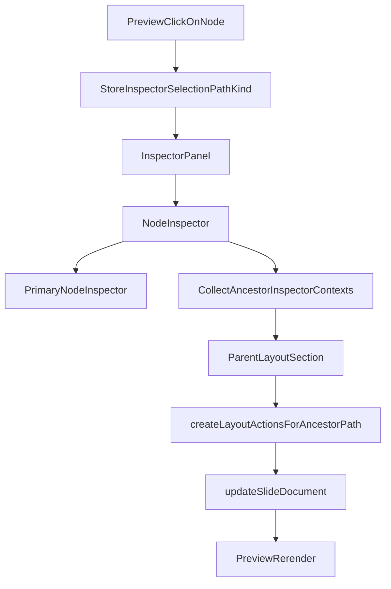

# Contextual Layout Inspector

## Goal
Сделать так, чтобы layout-настройки поднимались в правый инспектор **по контексту родителя**, а не требовали отдельного точного клика по layout-слою. Пользователь выбирает реальный content block (`card`, `quote`, `textRegion`, и т.д.), а инспектор показывает:
- настройки выбранного узла;
- настройки родительского `layout`;
- при необходимости более высокие ancestor-контексты;
- slide-level секции как отдельный уровень.

Для `splitLayout` это означает: ширина колонок редактируется в контексте выбранного блока внутри колонок, а не через невидимый gap-hit-area.

## Why The Current UX Fails
Сейчас root layout selection сделан через отдельную selectable-обёртку в [`src/presentation/json-renderer/JsonSlideRenderer.tsx`](src/presentation/json-renderer/JsonSlideRenderer.tsx), но дочерние content-узлы останавливают всплытие клика. В результате layout выбирается в основном через «пустую геометрию», а не через нормальный пользовательский сценарий.

Одновременно текущий inspector знает только **один** выбранный узел:
- [`src/creator/editor/inspector/selection.ts`](src/creator/editor/inspector/selection.ts) хранит один `path + kind`;
- [`src/creator/editor/inspector/NodeInspector.tsx`](src/creator/editor/inspector/NodeInspector.tsx) строит только один набор actions по `selection.kind`;
- ancestor context не вычисляется и не рендерится.

Это и есть корневая архитектурная причина плохого UX.

## Architecture Direction

### 1. Сохранить single selection, но сделать multi-context inspector
Selection model можно оставить как есть: один текущий выбранный узел.

Новый слой должен вычислять **ancestor chain** из `selection.path`, находить среди предков значимые editor-контексты (в первую очередь `layout`), и рендерить inspector как стек секций:
- `selected node`
- `parent layout`
- `higher parent layout` (если есть)
- `slide context`

То есть стор по-прежнему хранит один selection, но inspector строит **контекстную иерархию** поверх него.

### 2. Ввести ancestor resolution на основе canonical dot-path
В проекте уже есть единый path-формат и чтение по нему:
- [`src/creator/editor/inspector/pathOps.ts`](src/creator/editor/inspector/pathOps.ts)
- [`src/creator/editor/mutations/documentOps.ts`](src/creator/editor/mutations/documentOps.ts)
- [`src/creator/inline-edit/collectEditablePaths.ts`](src/creator/inline-edit/collectEditablePaths.ts)

Планируемый foundation:
- получить все родительские пути через последовательное отсечение последнего сегмента;
- для каждого пути прочитать узел документа;
- определить, является ли он поддерживаемым inspector-context (`layout`, позже возможно `stack` и др.);
- собрать ordered chain ближайших релевантных предков.

## Core Implementation Stages

### Stage 1. Добавить ancestor-path utilities
Цель: получить надёжную read-side основу для contextual inspector.

Файлы:
- [`src/creator/editor/mutations/documentOps.ts`](src/creator/editor/mutations/documentOps.ts) или новый соседний helper
- [`src/creator/editor/inspector/pathOps.ts`](src/creator/editor/inspector/pathOps.ts)

Добавить utilities уровня:
- `getParentPath(path)`
- `getAncestorPaths(path)`
- `resolveInspectorContext(path, doc)`
- `collectAncestorInspectorContexts(path, doc)`

Контракт:
- никакой fallback-магии по строкам вида `contains("layout")`
- только честное чтение узла по path и определение kind по реальной JSON-структуре
- корень документа обрабатывается отдельно, без пустого path как user-facing значения

### Stage 2. Ввести contextual composition поверх `NodeInspector`
Цель: превратить `NodeInspector` из single-node dispatcher в orchestrator контекстных секций.

Файл:
- [`src/creator/editor/inspector/NodeInspector.tsx`](src/creator/editor/inspector/NodeInspector.tsx)

Новая роль компонента:
- primary selection остаётся текущим узлом;
- компонент рендерит primary inspector как и раньше;
- затем добавляет ancestor sections для релевантных parent-контекстов;
- для каждого ancestor layout строит **свой** `selection-like` контекст и **свой** action facade через `createLayoutActions({ path: ancestorPath, doc, commit })`.

Важно:
- не дублировать ту же секцию, если primary selection уже `kind: 'layout'`;
- не ломать текущий `registry` и `NodeKindActions` ради одной задачи;
- лучше добавить composition layer поверх реестра, чем превращать `selection` в массив.

### Stage 3. Выделить reusable layout section UI
Цель: переиспользовать layout-настройки и для primary layout selection, и для parent-context rendering.

Файл:
- [`src/creator/editor/inspector/inspectors/LayoutInspector.tsx`](src/creator/editor/inspector/inspectors/LayoutInspector.tsx)

Подход:
- отделить reusable content-секции layout-а от оболочки “я отдельный инспектор выбранного узла”;
- чтобы можно было рендерить layout UI и как primary inspector, и как section внутри contextual stack;
- `splitLayout` controls не должны зависеть от того, был layout выбран напрямую или показан как parent context.

Практически это может выглядеть как:
- `LayoutInspector` остаётся entry component для primary selection;
- внутри него выносится `LayoutInspectorSections` / `LayoutContextSection`;
- `NodeInspector` вызывает те же sections для ancestor layout path.

### Stage 4. Сделать `splitLayout` first-class parent-context case
Цель: для любого блока внутри `splitLayout` инспектор показывал секцию родительского layout-а с управлением пропорциями.

Файлы:
- [`src/creator/editor/inspector/inspectors/LayoutInspector.tsx`](src/creator/editor/inspector/inspectors/LayoutInspector.tsx)
- [`src/creator/editor/mutations/actionTypes.ts`](src/creator/editor/mutations/actionTypes.ts)
- [`src/creator/editor/mutations/nodeActions.ts`](src/creator/editor/mutations/nodeActions.ts)

Поведение:
- клик по левому/правому `textRegion`, `card` или `quote` внутри split не требует отдельного выбора layout;
- в инспекторе появляется секция родителя `splitLayout`;
- linked controls `left/right` сохраняются;
- action layer держит инвариант суммы `12`, а UI не пишет неконсистентные значения.

Это должен быть основной UX-сценарий. Direct layout selection можно оставить вторичным, но он перестаёт быть обязательным способом добраться до пропорций.

### Stage 5. Нормализовать inspector hierarchy в UI
Цель: сделать правую панель читаемой, когда там несколько контекстов сразу.

Файлы:
- [`src/creator/editor/inspector/NodeInspector.tsx`](src/creator/editor/inspector/NodeInspector.tsx)
- возможно [`src/creator/editor/inspector/inspectorPrimitives.tsx`](src/creator/editor/inspector/inspectorPrimitives.tsx)

Нужна явная структура:
- `Текущий блок`
- `Родительский layout`
- `Внешний layout` (если есть nested chain)

Важно не скатиться в свалку. Контекстные секции должны быть компактнее primary inspector-а и явно маркироваться как parent-context.

## Data Flow

## Key Design Rules
- Пользователь выбирает **содержимое**, а не охотится за layout hit target.
- Layout-настройки поднимаются через **ancestor context**, а не через отдельный режим выбора слоя.
- Inspector остаётся selection-driven, но становится **context-aware**.
- Никакой fallback-логики по строковым эвристикам — только реальные ancestor paths и реальные JSON узлы.
- `splitLayout` — первый кейс, но foundation должен поддерживать дальнейшее поднятие `uniformGrid`, `bentoGrid`, nested `layout` chain.

## Suggested Files To Change
- [`src/creator/editor/inspector/NodeInspector.tsx`](src/creator/editor/inspector/NodeInspector.tsx)
- [`src/creator/editor/inspector/pathOps.ts`](src/creator/editor/inspector/pathOps.ts)
- [`src/creator/editor/mutations/documentOps.ts`](src/creator/editor/mutations/documentOps.ts)
- [`src/creator/editor/inspector/inspectors/LayoutInspector.tsx`](src/creator/editor/inspector/inspectors/LayoutInspector.tsx)
- [`src/creator/editor/mutations/actionTypes.ts`](src/creator/editor/mutations/actionTypes.ts)
- [`src/creator/editor/mutations/nodeActions.ts`](src/creator/editor/mutations/nodeActions.ts)
- при необходимости [`src/creator/editor/inspector/registry.ts`](src/creator/editor/inspector/registry.ts), но лучше минимизировать изменения реестра

## Verification
- При клике по левому/правому блоку внутри `splitLayout` в инспекторе видны и настройки самого блока, и секция родительского `splitLayout`.
- `left/right` пропорции меняются без отдельного выбора layout.
- Primary selection `layout` по-прежнему работает, но больше не является обязательным UX-путём.
- Nested layout path не ломается: если `card` лежит внутри вложенного layout, ancestor chain поднимается корректно.
- `mediaGallery` осознанно не включать в первую волну, пока не выровнен `basePath` в renderer.
- Прогнать `npm run typecheck` и `npm run build`.
