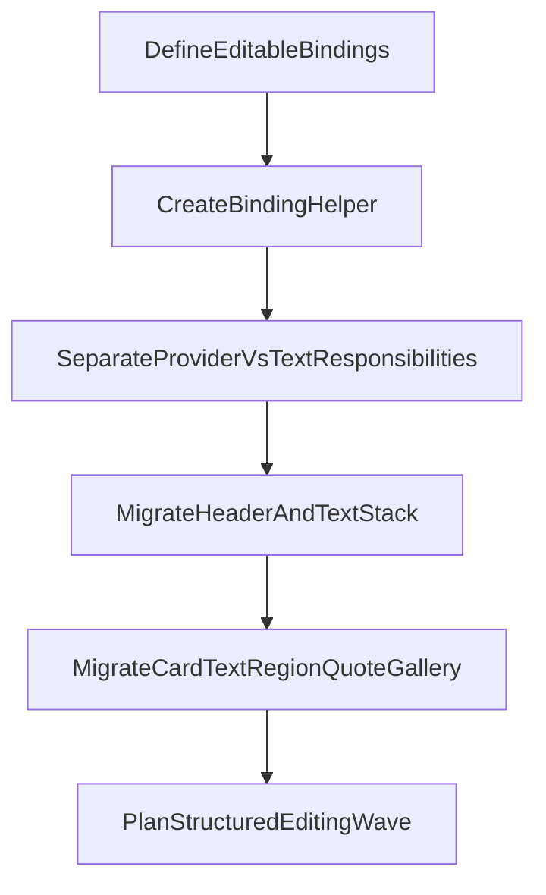

# План унификации inline-редактирования в Creator

## Цель этапа

Сделать единый слой описания редактируемых текстовых узлов поверх существующего JSON-рендерера, чтобы:

- убрать ручное дублирование `editorPath` в рендерерах;
- держать один источник правды для редактируемых полей;
- расширять покрытие plain-text без копипасты и рассинхрона;
- не сводить насильно разные JSON-сущности к одному типу там, где у них разная семантика.

## Архитектурная позиция

Унифицируем не весь JSON-контракт, а **editor-binding слой**.

Это значит:

- `header`, `card`, `text region`, `quote`, `textStack`, `imageCover`, `component rows` остаются разными доменными формами;
- поверх них появляется общий реестр `editable`-узлов: путь, тип редактирования, multiline/singleline, режим применения;
- React-рендереры получают не «захардкоженный путь», а готовый binding/desriptor.

## Целевая модель

Ввести единый реестр редактируемых узлов в зоне `src/creator/inline-edit/`.

Ориентир по форме:

```ts
interface EditableBinding {
  path: string;
  kind: 'plainText' | 'structuredText' | 'collectionField';
  multiline: boolean;
  enabled: boolean;
}
```

Минимум для этого этапа:

- `plainText` для scalar string-полей, которые можно редактировать прямо на тексте;
- `structuredText` для случаев, где сущность текстовая, но не сводится к одному scalar string;
- `collectionField` как задел для массивов/вложенных строк (`paragraphs[]`, `lines[]`, component rows).

## Что считаем первой волной унификации

В первую волну попадают только **plain-text поля**, естественные для inline-edit:

- `header.title`
- `header.lead`
- `header.meta`
- `textStack.items[].text` только для plain-ветки, не для `chunks`
- `card.subtitle.text`
- `card.items[].text`
- `card.slots[].items[].text`
- `text region items[].text`
- `quote.label` / `quote.subtitle` / `quote.text`
- `mediaGallery.items[].caption`

Во вторую волну оставить:

- `quote.paragraphs[]`
- component rows (`tagList`, `indexedList`, `featureList`)
- `textStack.chunks[]`
- `imageCover` rails / headline / lines

## Что не унифицировать насильно

Следующие семейства не нужно сводить к общей модели `{ variant, text }`:

- [src/presentation/json-renderer/JsonImageCoverShell.tsx](/Users/jn0izzze/OtherAIPro/newgen/src/presentation/json-renderer/JsonImageCoverShell.tsx)
- [src/presentation/json-renderer/nodes/JsonQuoteNode.tsx](/Users/jn0izzze/OtherAIPro/newgen/src/presentation/json-renderer/nodes/JsonQuoteNode.tsx)
- [src/presentation/json-renderer/jsonSlideCardComponentRegistry.tsx](/Users/jn0izzze/OtherAIPro/newgen/src/presentation/json-renderer/jsonSlideCardComponentRegistry.tsx)

Для них нужен общий editor-протокол, но не единый доменный тип.

## Основные изменения по слоям

### 1. Сделать `collectEditablePaths` реальным source of truth

Текущий файл [src/creator/inline-edit/collectEditablePaths.ts](/Users/jn0izzze/OtherAIPro/newgen/src/creator/inline-edit/collectEditablePaths.ts) уже намекает на нужный слой, но пока не управляет рантаймом.

Нужно развить его в реестр binding-ов:

- описывать не только `path`, но и тип поля, multiline, ограничения;
- отдельно различать plain-text и structured cases;
- использовать этот слой и для commit/patch, и для подключения editor props в рендерере.

### 2. Вынести binding helper над `useEditorMode`

Сейчас `JsonSlideShell` и `JsonTextStackShell` повторяют одинаковый шаблон спреда editor-props. Нужен общий helper/adapter в `inline-edit`, который:

- принимает binding;
- проверяет, что поле реально editable в текущем документе;
- возвращает готовые props для `Text`.

Это снимет копипасту из:

- [src/presentation/json-renderer/JsonSlideShell.tsx](/Users/jn0izzze/OtherAIPro/newgen/src/presentation/json-renderer/JsonSlideShell.tsx)
- [src/presentation/json-renderer/JsonTextStackShell.tsx](/Users/jn0izzze/OtherAIPro/newgen/src/presentation/json-renderer/JsonTextStackShell.tsx)
- будущих `JsonCardNode` / `JsonTextRegionNode`

### 3. Развести ответственности `Text` и `EditorModeProvider`

Сейчас откат значения частично делают оба слоя. Нужно чётко развести:

- `Text` отвечает только за DOM-level UX (`focus`, `blur`, `Escape`, `Enter`);
- `EditorModeProvider` отвечает за состояние редактирования и commit/cancel semantics;
- binding layer отвечает за знание «что editable и куда писать».

Это уменьшит coupling и уберёт дублирование поведения.

### 4. Расширить редакторские точки входа на общие ноды

После появления binding layer следующими подключать не новые shell-исключения, а общие ноды:

- [src/presentation/json-renderer/nodes/JsonCardNode.tsx](/Users/jn0izzze/OtherAIPro/newgen/src/presentation/json-renderer/nodes/JsonCardNode.tsx)
- [src/presentation/json-renderer/nodes/JsonTextRegionNode.tsx](/Users/jn0izzze/OtherAIPro/newgen/src/presentation/json-renderer/nodes/JsonTextRegionNode.tsx)
- [src/presentation/json-renderer/nodes/JsonQuoteNode.tsx](/Users/jn0izzze/OtherAIPro/newgen/src/presentation/json-renderer/nodes/JsonQuoteNode.tsx)
- [src/presentation/json-renderer/layouts/JsonMediaGalleryLayout.tsx](/Users/jn0izzze/OtherAIPro/newgen/src/presentation/json-renderer/layouts/JsonMediaGalleryLayout.tsx)

Это даёт максимальный выигрыш по покрытию за минимальное число точек интеграции.

## Предлагаемая последовательность внедрения



## Порядок работ

1. Зафиксировать taxonomy text-bearing сущностей и отметить, какие относятся к `plainText`, а какие к `structuredText`.
2. Превратить `collectEditablePaths` в полноценный binding registry и API доступа к binding-ам.
3. Ввести единый helper для подключения `contentEditable` к `Text` без ручного спреда editor-props.
4. Подключить helper к уже существующим точкам (`header`, `textStack`) без изменения UX.
5. Подключить общие ноды (`card`, `text region`, `quote`, `gallery caption`) к той же binding-модели.
6. Отдельно описать вторую волну structured-edit полей: `paragraphs[]`, `chunks[]`, component rows, `imageCover`.

## Риски и защитные решения

- Строковые пути могут разъехаться с реальной схемой.
  Решение: binding registry должен быть единственным местом генерации path.
- Разные сущности требуют разного UX, и слишком ранняя унификация сломает семантику.
  Решение: унификация только на editor-protocol уровне, не на уровне всех JSON-моделей.
- `imageCover` и component rows могут резко усложнить первую волну.
  Решение: официально исключить их из первого этапа и держать как отдельную дорожку.

## Definition of Done для этапа

- Все plain-text поля первой волны описаны одним registry binding-ов.
- Рендереры больше не содержат размноженных вручную editor-props и не являются источником truth для путей.
- Header/textStack/card/textRegion/quote/gallery используют один и тот же editor-binding подход.
- Структурно сложные сущности явно выделены в следующую волну, без компромиссных полумер.

## Ключевые файлы этапа

- [src/creator/inline-edit/collectEditablePaths.ts](/Users/jn0izzze/OtherAIPro/newgen/src/creator/inline-edit/collectEditablePaths.ts)
- [src/creator/inline-edit/EditorModeProvider.tsx](/Users/jn0izzze/OtherAIPro/newgen/src/creator/inline-edit/EditorModeProvider.tsx)
- [src/creator/inline-edit/EditorModeContext.tsx](/Users/jn0izzze/OtherAIPro/newgen/src/creator/inline-edit/EditorModeContext.tsx)
- [src/ui/slides/Text.tsx](/Users/jn0izzze/OtherAIPro/newgen/src/ui/slides/Text.tsx)
- [src/presentation/json-renderer/JsonSlideShell.tsx](/Users/jn0izzze/OtherAIPro/newgen/src/presentation/json-renderer/JsonSlideShell.tsx)
- [src/presentation/json-renderer/JsonTextStackShell.tsx](/Users/jn0izzze/OtherAIPro/newgen/src/presentation/json-renderer/JsonTextStackShell.tsx)
- [src/presentation/json-renderer/nodes/JsonCardNode.tsx](/Users/jn0izzze/OtherAIPro/newgen/src/presentation/json-renderer/nodes/JsonCardNode.tsx)
- [src/presentation/json-renderer/nodes/JsonTextRegionNode.tsx](/Users/jn0izzze/OtherAIPro/newgen/src/presentation/json-renderer/nodes/JsonTextRegionNode.tsx)
- [src/presentation/json-renderer/nodes/JsonQuoteNode.tsx](/Users/jn0izzze/OtherAIPro/newgen/src/presentation/json-renderer/nodes/JsonQuoteNode.tsx)
- [src/presentation/json-renderer/layouts/JsonMediaGalleryLayout.tsx](/Users/jn0izzze/OtherAIPro/newgen/src/presentation/json-renderer/layouts/JsonMediaGalleryLayout.tsx)
- [src/presentation/json-renderer/JsonImageCoverShell.tsx](/Users/jn0izzze/OtherAIPro/newgen/src/presentation/json-renderer/JsonImageCoverShell.tsx)
- [src/presentation/jsonSlideTypes.ts](/Users/jn0izzze/OtherAIPro/newgen/src/presentation/jsonSlideTypes.ts)