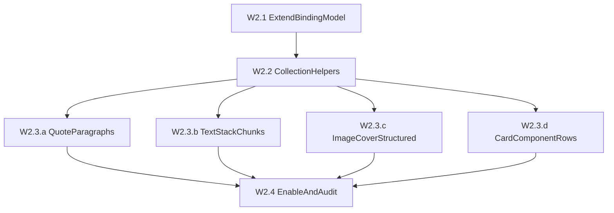

# Wave 2 Plan — Structured Inline Editing in Creator

**Status:** DESIGN-ONLY (May 2026). Wave 2 is **NOT implemented in this cycle**.
**Scope:** Markdown-only blueprint for the second pass of inline editing — moving from `plainText` scalars (wave 1) to `structuredText` / `collectionField` entities.

---

## References

- Project conventions: [CLAUDE.md](../../CLAUDE.md)
- JSON-renderer contract: [src/presentation/json-renderer/README.md](../../src/presentation/json-renderer/README.md)
- Wave 1 plan: [creator-edit-unification_1ce3cb11.plan.md](./creator-edit-unification_1ce3cb11.plan.md)
- Full taxonomy of text-bearing fields: [creator-edit-taxonomy.md](./creator-edit-taxonomy.md)
- Live binding registry: [src/creator/inline-edit/collectEditablePaths.ts](../../src/creator/inline-edit/collectEditablePaths.ts)
- Binding hook: [src/creator/inline-edit/useEditableBinding.ts](../../src/creator/inline-edit/useEditableBinding.ts)

> The detailed per-path inventory lives in `creator-edit-taxonomy.md` (sections **Wave 2** and **Wave 3**). This document does **not** repeat that table — it adds the *editor-layer* design on top of it.

---

## Wave 2 Targets (strict list)

Wave 2 covers exactly four entity families. Each is already marked `enabled: false` (or absent) in `collectEditableBindings()` and treated as `structuredText` / `collectionField` in [creator-edit-taxonomy.md](./creator-edit-taxonomy.md):

1. **`quote.paragraphs[]`** — array of paragraph strings, each rendered as a separate `SlidePromptQuote`.
2. **`textStack.items[].chunks[]`** — chunk branch of text items (`{ text, tone?, decoration? }`).
3. **`imageCover`** structured zones:
   - `cover.topRail.items[].items[].lines[]` and `cover.bottomRail.items[].items[].lines[]` — **cluster** rail items (`kind: "cluster"`),
   - `cover.headline.blocks[]` as a composed multi-block element (when more than one block exists),
   - cluster `lines[]` arrays themselves (the strings inside each clustered text node).
4. **Component rows** under `card.items[]` with `type: "component"`:
   - `tagList` — `items[].label`
   - `indexedList` — `items[].title`, `items[].subtitle?`, `items[].index`
   - `featureList` — `items[].label`, `items[].value` (`items[].icon` stays out of scope; see [Out of scope](#out-of-scope))

---

## Per-group analysis

### 1. `quote.paragraphs[]`

**Why not plainText.** It is an array of strings (`string[]`), not a scalar. Each element becomes a separate `<SlidePromptQuote>` block in `src/presentation/json-renderer/nodes/JsonQuoteNode.tsx`. Wave 1 already covers `quote.text` (single string) and `quote.label` / `quote.subtitle`; the multi-paragraph variant is a different shape and a different UX.

**UX questions.**
- Add / remove paragraph entries (the array length changes).
- Reorder paragraphs (drag-and-drop within the quote).
- Empty-paragraph rule: today renderer filters `p.trim().length > 0`. Editor must decide between hiding empty entries vs. blocking the commit.
- Interaction with `quote.text`: parser requires "at least one of `text` or non-empty `paragraphs`". Editor must not produce an invalid quote (both empty).
- Per-paragraph multiline (each paragraph itself supports `\n` inside the string).

**Model additions in `EditableBinding`.** Extend the union with `kind: 'collectionField'` plus extra fields (optional in the type, required only when `kind === 'collectionField'`):
- `arrayPath: string` — path to the parent array.
- `itemPath?: string` — when the binding represents one element.
- `itemKind: 'plainText'` — element type.
- `minItems?` / `maxItems?` (none currently enforced for paragraphs; "quote.text OR paragraphs ≥ 1" lives as a separate validator).
- `addItemTemplate?: () => unknown` — factory for the empty new entry (here: `""`).

**Helpers / components.**
- `useEditableArray(arrayPath)` → `{ items, append, remove, move, replace }`, wired through `EditorModeProvider` commit semantics.
- `<EditableParagraphList path="...quote.paragraphs">` — renders each paragraph through the existing `<Text>` (multiline plain-text path) and exposes add / remove / reorder controls when editor is active.
- Existing `useEditableTextProps` stays the per-element editor; it gains a sibling `useEditableArrayProps(arrayPath)` for collection-level ops.

**Code touchpoints.**
- `src/presentation/json-renderer/nodes/JsonQuoteNode.tsx` — replace the inline `.map` with `<EditableParagraphList>` and pass per-paragraph path.
- `src/creator/inline-edit/collectEditablePaths.ts` `walkQuote` — emit one `collectionField` binding for `paragraphs` plus per-element `plainText` bindings with `enabled: true`.

---

### 2. `textStack.items[].chunks[]`

**Why not plainText.** A `chunks`-bearing text item is an inline-marked sequence; each chunk has `{ text, tone?: 'default' | 'accent', decoration?: 'none' | 'lineThrough' }`. Output is a `` per chunk with conditional classes (`src/presentation/json-renderer/JsonTextStackShell.tsx`). The collector explicitly excludes such items today (`if ('chunks' in item) return;`).

**UX questions.**
- Edit each chunk's text inline (per-chunk contentEditable spans).
- Insert / split / merge chunks: where does the caret go when a chunk's last character is deleted? Where do new chunks get appended?
- Toggle `tone` / `decoration` on a selected chunk — explicitly **out of scope** for wave 2 (styling); only the *textual* part of chunks is in scope.
- Disallow producing an empty chunk array (parser invariant).
- Mutually-exclusive `text` vs `chunks` rule — editor cannot switch the row between forms.

**Model additions in `EditableBinding`.**
- `kind: 'structuredText'`.
- `path: stack.items.{i}.chunks` (the array).
- Sub-bindings (one per chunk): `kind: 'plainText'`, path `stack.items.{i}.chunks.{j}.text`, `multiline: false`, `enabled: true`.
- Optional flag `containerKind: 'inlineChunks'` on the parent binding (no ` ` between elements).

**Helpers / components.**
- `<EditableChunksEditor path="stack.items.X.chunks">` — wraps the existing `` render path: reuses `useEditableTextProps()` per chunk for text; draws a thin toolbar (only when editor is active) for add/remove chunks (not for `tone`/`decoration`).
- Path resolver `getByPath` / `setByPath` already supports numeric segments — no change.

**Code touchpoints.**
- `JsonTextStackShell.tsx` `renderTextStackTextContent` — when in editor mode, render chunk spans through the new editor.
- `JsonTextStackShell.tsx` `TextStackTextItem` — switch off the "item-level" `useEditableTextProps` when `'chunks' in item` and delegate to the chunks editor.
- `collectEditablePaths.ts` `collectStack` — when `'chunks' in item`, emit a `structuredText` parent binding and per-chunk `plainText` children.

---

### 3. `imageCover` rails clusters, headline composition, cluster lines

**Why not plainText.**
- Cluster rail items are `kind: "cluster"` with `gap` + an array of sub-items, each with its own `lines[]`. Rendered as a flex row of `<Text variant="overline">`; editing one line affects a nested sub-item.
- Headline composition is `cover.headline.blocks[]` where each block carries `text`, `font`, `size`, `italic`, `color`, `weight`. Wave 1 edits `block.text` per individual block as plain text (multiline). Wave 2 deals with the *composition* — adding / removing / reordering blocks while preserving typography slots.
- Cluster lines themselves: although each line is `string`, the path is doubly-nested (`cover.topRail.items.{i}.items.{j}.lines.{k}`) and the rendering groups them in a `<Text>` per cluster sub-item via `linesToNodes()`. Array-level operations (add / remove a line inside a cluster sub-item) are structured.

**UX questions.**
- Cluster: add a sub-item, remove, reorder. Keep `gap: md | lg` immutable in wave 2.
- Cluster line: edit each `lines[k]` inline; add / remove lines (each line maps to one ` `-separated row inside the `<Text>`).
- Headline: add / remove / reorder blocks. **Do not** edit per-block typography (font / size / italic / color / weight).
- Frame-position fields (`offsetYPx`, `stack`, `align`) stay non-editable.

**Model additions in `EditableBinding`.**
- For each cluster item: `kind: 'collectionField'`, `arrayPath: cover.topRail.items.{i}.items`, item factory `() => ({ kind: 'text', lines: [''] })`.
- For each cluster sub-item's `lines`: `kind: 'collectionField'`, `arrayPath: ...items.{j}.lines`, item factory `() => ''`.
- For headline blocks composition: `kind: 'collectionField'`, `arrayPath: cover.headline.blocks`. To keep wave 2 minimal, restrict adding new blocks to *cloning the last block's typography metadata*.

**Helpers / components.**
- `<EditableLinesEditor path="cover.{topRail|bottomRail}.items.{i}.items.{j}.lines">` — renders one `<Text variant="overline">` whose visible newlines map to `lines[]` entries.
- `<EditableClusterEditor path="cover.{topRail|bottomRail}.items.{i}.items">` — wraps the cluster flex row; allows adding sub-items.
- `<EditableHeadlineBlocks path="cover.headline.blocks">` — wraps the multi-block headline render path. Per-block `text` keeps the wave 1 binding.

**Code touchpoints.**
- `JsonImageCoverShell.tsx` `renderTopRailItem` — branch `kind === 'cluster'` becomes `<EditableClusterEditor>` in editor mode.
- `JsonImageCoverShell.tsx` `renderBottomItem` + `renderBottomTextItem` — same.
- `JsonImageCoverShell.tsx` `renderHeadline` — wrap the `blocks.map(...)` in `<EditableHeadlineBlocks>`; preserve all three layout branches (`stack === 'br' | 'tight' | <default>`).
- `collectEditablePaths.ts` `collectCover` + `collectRail` — emit cluster bindings (`kind: 'collectionField'`) alongside today's plain-text rail lines.

---

### 4. Card component rows (`tagList`, `indexedList`, `featureList`)

**Why not plainText.** These rows are `type: "component"` items inside `card.items[]`. The collector deliberately excludes them: `if (item['type'] === 'component') return;`. Rendered shape is component-specific:
- `tagList` — pill grid with `items[].label`.
- `indexedList` — numbered rows with `items[].index | title | subtitle?`.
- `featureList` — icon + label + value rows.

**UX questions.**
- Each component is an array (`items[]`) with strict element shape. Editing one cell is plain text; adding / removing rows is collection-level.
- `tagList`: duplicate labels are rejected at parse time. Editor must surface validation.
- `indexedList`: `index` is non-negative integer **unique within the list** — editor must auto-assign or validate.
- `featureList`: `icon` must be from `JSON_SLIDE_CARD_ICON_IDS` — icon picking is **out of scope** for wave 2; only `label`, `value` are editable. New rows inherit the previous row's icon.
- Reorder rows (drag).
- Card-level constraint: adding / removing component items at the *parent* `card.items[]` level is part of wave 3 (out of scope here).

**Model additions in `EditableBinding`.**
- For each component-row instance, emit:
  - a `collectionField` binding for the inner `items[]`,
  - per-element `plainText` bindings for each textual field of the inner row.
- Add field `validator?: (value, doc) => string | null` for component-specific invariants (unique `tagList` label, unique `indexedList.index`).
- Add field `serializer?` / `parser?` for cases where editor surface (string) and JSON shape (number, e.g. `indexedList.index`) differ.

**Helpers / components.**
- `useEditableArray(arrayPath)` (shared with quote / cluster).
- Per-component editors on top of registry components: `JsonCardTagListEditor`, `JsonCardIndexedListEditor`, `JsonCardFeatureListEditor`.
- Dispatch helper `renderJsonCardComponentItemEditable(tone, item, index, path)` parallel to existing `renderJsonCardComponentItem()` — picked by `JsonCardNode` when editor is active.

**Code touchpoints.**
- `jsonSlideCardComponentRegistry.tsx` — add an editable dispatcher next to `renderJsonCardComponentItem`.
- `JsonCardNode.tsx` — pass `path` down to the registry dispatch so each component item knows its absolute dot-path.
- `collectEditablePaths.ts` `collectCardItemText` — split into `collectCardItemText` (plain) + `collectCardItemComponent` (structured) and emit component-specific bindings.

---

## Sequenced stages

### Stage W2.1 — Extend the binding model
- Extend `EditableBinding` with `collectionField` shape: `arrayPath`, `itemPath?`, `itemKind`, `minItems?`, `maxItems?`, `addItemTemplate?`, `validator?`, `serializer?`, `parser?`.
- Update `EditableKind` + `EditableBinding` interface.
- Keep wave 1 emission intact; add wave 2 emission paths behind `enabled: false`.

### Stage W2.2 — Base collection helpers
- Add `useEditableArray(arrayPath)` next to `useEditableBinding` / `useEditableTextProps`.
- Surface `append` / `remove` / `move` / `replace` on top of the existing `setByPath`.
- Re-export from `src/creator/inline-edit/index.ts`.

> Stages W2.1 and W2.2 are sequential.

### Stage W2.3 — Migrate concrete nodes (parallelizable)

Once W2.1 + W2.2 are in place, the four sub-stages can be done **in parallel**:

- **W2.3.a — Quote paragraphs.** `JsonQuoteNode.tsx` + `walkQuote()`.
- **W2.3.b — TextStack chunks.** `JsonTextStackShell.tsx` + `collectStack()`.
- **W2.3.c — Image cover structured zones.** `JsonImageCoverShell.tsx` + `collectCover` / `collectRail`.
- **W2.3.d — Card component rows.** `jsonSlideCardComponentRegistry.tsx`, `JsonCardNode.tsx`, `walkCard()` / `collectCardItemText()`.

### Stage W2.4 — Final pass
- Promote `enabled: true` for wave 2 bindings once W2.3 sub-stages converge.
- Audit: `npm run typecheck`, `npm run build`, lint, visual smoke (`npm run dev`).
- Update `creator-edit-taxonomy.md` "Wave 2 Deferred" section to "Wave 2 Done".

---

## Out of scope

Explicit non-goals for wave 2 (remain non-editable, or live in a hypothetical wave 3+):

- **Image / video assets.** `background.src`, `background.alt`, `mediaGallery.items[].src`, `textStack.items[].src`.
- **Icon ids.** `leadingIcon`, `watermarkIcon`, `featureList.items[].icon`, `iconBadge.icon`. Picker UI for `JSON_SLIDE_CARD_ICON_IDS` is out of scope.
- **Layout / structural ids.** `layout.type`, `frame.align`, `frame.padding`, `backdrop.variant`, `backdrop.borderFrame`, `content.width / density / align`, `template`, `cover.headline.stack / align / offsetYPx`.
- **Typography / style tokens.** `font`, `size`, `color`, `weight`, `italic`, `tone`, `decoration`, `surface`, `justify`, `gap`, `padding`, `stackGap`. Wave 2 edits text *inside* a chunk but never flips its `tone` / `decoration`; edits text *inside* a headline block but never flips its `font` / `size`.
- **Cross-array surgery.** Moving cards between slides, moving items between cards, swapping `card.items[]` ↔ `card.slots[]`, splitting / merging columns, drag-and-drop across regions.
- **Per-component metadata** beyond text: `tagList.variant / direction / gap`, `indexedList.gap`, `featureList.gap`, `headerBadge.tone`, `card.tone`, `card.surface`, `cluster.gap`.

---

## Wave 2 Definition of Done

- `EditableBinding` supports `collectionField` end-to-end (model + helpers + commit semantics).
- `quote.paragraphs[]`, `textStack chunks`, `imageCover` clusters / headline composition, and the three component-row text fields are editable, with add / remove / reorder where applicable.
- Validation invariants (`tagList` unique label, `indexedList` unique `index`, quote "text OR paragraphs ≥ 1") are enforced by the binding layer, not the renderer.
- No new field is editable that lives in the [Out of scope](#out-of-scope) list.
- `creator-edit-taxonomy.md` "Wave 2 Deferred" rows are checked off and moved to "Wave 2 Done".

---

## Key files for Wave 2 implementation

- `src/creator/inline-edit/collectEditablePaths.ts`
- `src/creator/inline-edit/useEditableBinding.ts`
- `src/presentation/json-renderer/nodes/JsonQuoteNode.tsx`
- `src/presentation/json-renderer/JsonTextStackShell.tsx`
- `src/presentation/json-renderer/JsonImageCoverShell.tsx`
- `src/presentation/json-renderer/jsonSlideCardComponentRegistry.tsx`
