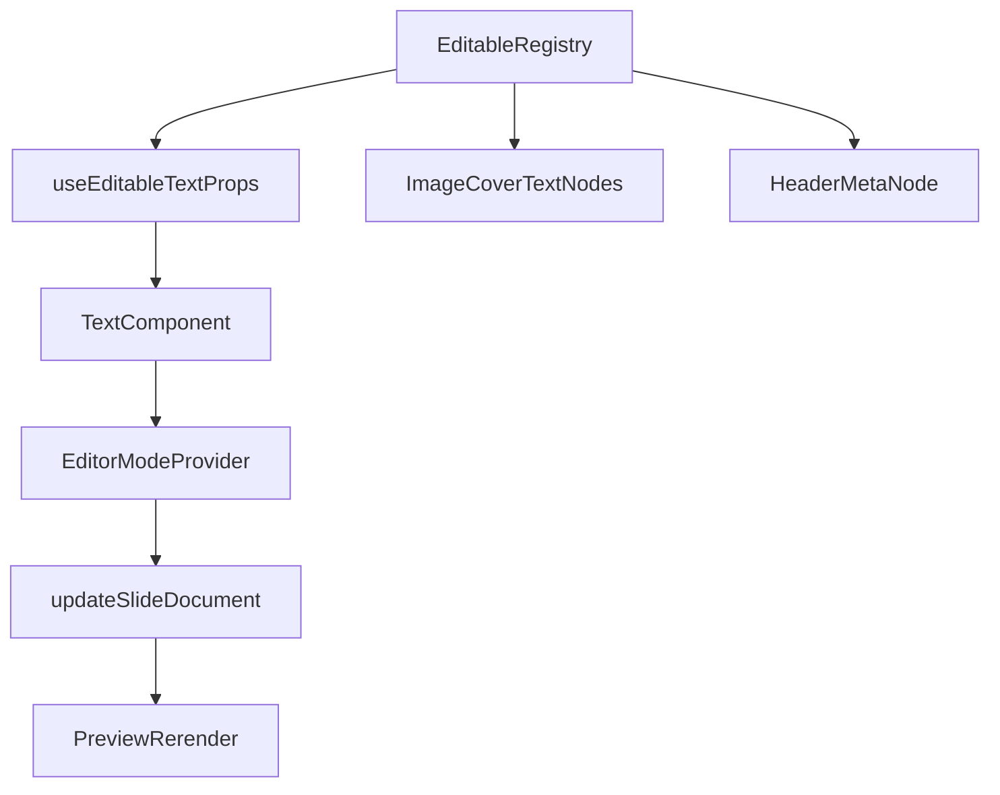

# План добивки первой волны inline-edit

## Цель
Закрыть рассинхрон между `editable`-registry и реальным preview-редактированием в Creator:
- если plain-text поле объявлено editable в registry, оно должно редактироваться прямо на слайде;
- inspector не должен отправлять в `Raw JSON` для полей, которые уже реально доступны inline.

## Текущее состояние
Inline-edit уже подключён в:
- [src/presentation/json-renderer/JsonSlideShell.tsx](src/presentation/json-renderer/JsonSlideShell.tsx)
- [src/presentation/json-renderer/JsonTextStackShell.tsx](src/presentation/json-renderer/JsonTextStackShell.tsx)
- [src/presentation/json-renderer/nodes/JsonCardNode.tsx](src/presentation/json-renderer/nodes/JsonCardNode.tsx)
- [src/presentation/json-renderer/nodes/JsonQuoteNode.tsx](src/presentation/json-renderer/nodes/JsonQuoteNode.tsx)
- [src/presentation/json-renderer/nodes/JsonTextRegionNode.tsx](src/presentation/json-renderer/nodes/JsonTextRegionNode.tsx)
- [src/presentation/json-renderer/layouts/JsonMediaGalleryLayout.tsx](src/presentation/json-renderer/layouts/JsonMediaGalleryLayout.tsx)

Но registry в [src/creator/inline-edit/collectEditablePaths.ts](src/creator/inline-edit/collectEditablePaths.ts) уже объявляет editable-поля, которые ещё не доведены в preview-renderer:
- `header.meta`
- `cover.topRail.items.*.lines.*`
- `cover.bottomRail.items.*.lines.*`
- `cover.headline.blocks.*.text`

При этом [src/presentation/json-renderer/JsonImageCoverShell.tsx](src/presentation/json-renderer/JsonImageCoverShell.tsx) пока не подключён к helper-слою `useEditableTextProps`, а [src/creator/editor/inspector/StructuredInspector.tsx](src/creator/editor/inspector/StructuredInspector.tsx) всё ещё направляет `imageCover`-текст в `Raw JSON`.

## Граница этапа
Берём только plain-text completion первой волны:
- `header.meta`
- `imageCover.headline.blocks[].text`
- `imageCover.topRail.items[].lines[]`
- `imageCover.bottomRail.items[].lines[]`

Не берём в этот этап:
- `paragraphs[]`
- `chunks[]`
- component rows
- add/remove/reorder коллекций
- layout/template mutation
- вторую волну structured editing

## Архитектурный принцип
Не добавлять новый parallel-слой редактирования. Использовать уже существующий pipeline:
- registry путей в [src/creator/inline-edit/collectEditablePaths.ts](src/creator/inline-edit/collectEditablePaths.ts)
- adapter/helper в [src/creator/inline-edit/useEditableBinding.ts](src/creator/inline-edit/useEditableBinding.ts)
- `Text` как единый editable host в [src/ui/slides/Text.tsx](src/ui/slides/Text.tsx)
- `EditorModeProvider` как commit/cancel orchestration в [src/creator/inline-edit/EditorModeProvider.tsx](src/creator/inline-edit/EditorModeProvider.tsx)

То есть задача не в новом механизме, а в подключении уже существующего механизма к недостающим render-зонам.

## Порядок реализации
1. Подключить `header.meta` к inline-edit в [src/presentation/json-renderer/JsonSlideShell.tsx](src/presentation/json-renderer/JsonSlideShell.tsx), чтобы header был полностью консистентен: `meta`, `title`, `lead`.
2. Разобрать [src/presentation/json-renderer/JsonImageCoverShell.tsx](src/presentation/json-renderer/JsonImageCoverShell.tsx) на точки подключения editable bindings:
   - top rail text lines
   - headline block text
   - bottom rail text lines
3. Для каждого из этих узлов провести path-aware wiring через `useEditableTextProps(...)` и `Text`, не ломая текущую типографику и layout imageCover.
4. Проверить multiline semantics:
   - headline blocks — multiline
   - rail lines — single-line scalar fields
5. После подключения обновить copy в [src/creator/editor/inspector/StructuredInspector.tsx](src/creator/editor/inspector/StructuredInspector.tsx), чтобы `imageCover` больше не отправлял пользователя в `Raw JSON` для уже поддержанных inline полей.
6. Финально сверить registry в [src/creator/inline-edit/collectEditablePaths.ts](src/creator/inline-edit/collectEditablePaths.ts) с реальным renderer coverage и убрать всё, что остаётся неподключённым, если такое останется.

## Поток подключения

## Основные файлы этапа
- [src/creator/inline-edit/collectEditablePaths.ts](src/creator/inline-edit/collectEditablePaths.ts)
- [src/creator/inline-edit/useEditableBinding.ts](src/creator/inline-edit/useEditableBinding.ts)
- [src/creator/inline-edit/EditorModeProvider.tsx](src/creator/inline-edit/EditorModeProvider.tsx)
- [src/ui/slides/Text.tsx](src/ui/slides/Text.tsx)
- [src/presentation/json-renderer/JsonSlideShell.tsx](src/presentation/json-renderer/JsonSlideShell.tsx)
- [src/presentation/json-renderer/JsonImageCoverShell.tsx](src/presentation/json-renderer/JsonImageCoverShell.tsx)
- [src/creator/editor/inspector/StructuredInspector.tsx](src/creator/editor/inspector/StructuredInspector.tsx)

## Риски
- `imageCover` сильно завязан на декоративную типографику и позиционирование; неосторожное добавление editable-host может поменять line-height, spacing или pointer behavior.
- Для rail lines путь указывает на отдельные scalar строки внутри массива; нужно аккуратно сохранить соответствие между одной rendered line и одним dot-path.
- Если оставить в registry неподключённые поля, система продолжит врать о своих возможностях.

## Definition of Done
- `header.meta` редактируется inline так же, как `header.title` и `header.lead`.
- Текстовые зоны `imageCover` первой волны редактируются прямо на превью.
- `StructuredInspector` больше не отправляет `imageCover`-text в `Raw JSON`, если эти поля уже доступны inline.
- Registry и renderer coverage совпадают для полей первой волны.
- Этап не заходит в structured/collection editing и не плодит fallback-логику.