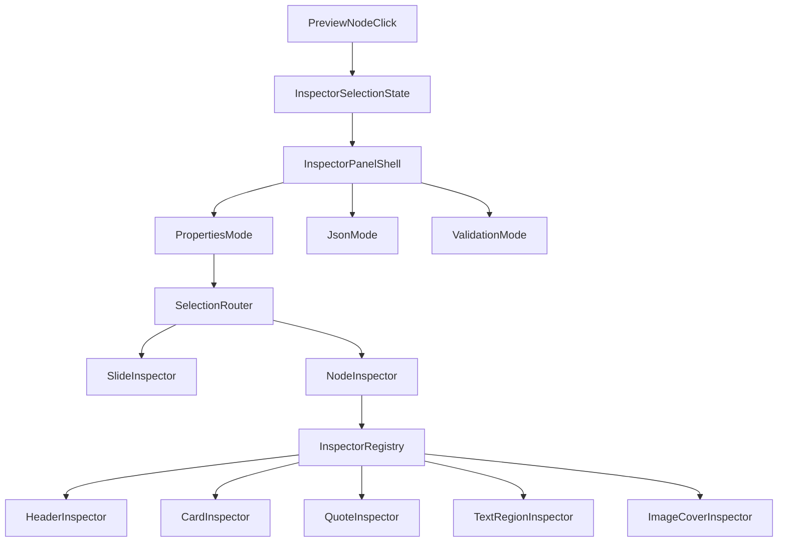

# План рефакторинга инспектора Creator

## Цель
Перевести правую панель Creator с текущей модели «форма всего слайда по template-веткам» на модель «инспектор выбранного объекта документа», сохранив отдельные режимы для `JSON` и `Validation`.

Итоговое поведение:
- если ничего не выбрано, справа показывается `SlideInspector`;
- если выбран конкретный объект на сцене, справа показывается `NodeInspector` только для этого объекта;
- `JSON` и `Validation` остаются отдельными, не смешиваются с object-properties.

## Что структурно ломает текущий дизайн
Текущий инспектор:
- организован по `template` (`default` / `imageCover` / `textStack`), а не по объектному дереву документа;
- не имеет модели selection, кроме локального `editingPath` для inline-text;
- смешивает в одном компоненте `slide meta`, `document controls`, `node-like editing`, `JSON recovery`, `validation`;
- дублирует знание о JSON-структуре через локальные `patchHeader`, `patchContent`, `patchStack`, `patchBackground` и аналогичные helper-ветки.

Это противоречит SRP:
- `InspectorPanel` одновременно роутит режимы, хранит UI-state и определяет форму документа;
- `StructuredInspector` одновременно является и slide inspector, и document inspector, и template-specific form renderer.

## Архитектурная цель
Сделать 4 независимых слоя:

1. `selection model`
- источник правды о том, что сейчас выбрано на сцене;
- не завязан на edit-session текста.

2. `inspector shell`
- роутинг между `Properties`, `JSON`, `Validation`;
- empty/loading/invalid states.

3. `inspector registry`
- маппинг `selection.kind -> inspector component`;
- единая точка диспетча без template-ветвлений.

4. `inspector sections/components`
- отдельные специализированные инспекторы для slide-level и node-level сущностей.

## Ключевой принцип модели
Каноническим идентификатором selection должен стать `path` в дереве документа, а не ad hoc id.

Минимальная форма:

```ts
type InspectorSelection =
  | { scope: 'slide' }
  | {
      scope: 'node';
      path: string;
      kind:
        | 'header'
        | 'card'
        | 'quote'
        | 'textRegion'
        | 'layout'
        | 'mediaGallery'
        | 'mediaItem'
        | 'imageCoverHeadline'
        | 'imageCoverRail'
        | 'imageCoverBackground';
    };
```

`editingPath` из [src/creator/inline-edit/EditorModeContext.tsx](src/creator/inline-edit/EditorModeContext.tsx) не расширять до selection state: edit-session и selection — разные ответственности.

## Целевой дизайн файлов
### Shell / state
- [src/creator/editor/inspector/InspectorPanel.tsx](src/creator/editor/inspector/InspectorPanel.tsx) — thin shell
- новая selection-зона в `src/creator/editor/selection/` или рядом с editor store
- при необходимости новый `SelectionContext` вместо перегруза `EditorModeContext`

### Slide-level
- `SlideInspector` для `slide.title`, `speakerNotes`, theme, template-level controls
- `DocumentInspector` или document sections для общих настроек документа

### Node-level
- `NodeInspector`
- registry `kind -> component`
- первая волна специализированных инспекторов:
  - `HeaderInspector`
  - `CardInspector`
  - `QuoteInspector`
  - `TextRegionInspector`
  - `ImageCoverInspector`

### Shared infra
- path-aware helper для чтения/патча выбранного узла из документа
- общие field/section primitives, чтобы не дублировать однотипные label/select/input layouts

## DRY / SRP ориентиры
### DRY
- path-based patching и lookup должны жить в одном месте, а не пересобираться в каждом inspector-е;
- повторяемые UI-секции (`Section`, `Field`, node header, empty state, property group) — shared primitives;
- диспетч node inspector-ов — через registry, а не через размноженные `if template === ...`.

### SRP
- selection infra отвечает только за выделение;
- inspector shell отвечает только за навигацию и режимы панели;
- slide inspector отвечает только за свойства слайда;
- node inspectors отвечают только за конкретный `kind`;
- raw json и validation не знают о selection, кроме чтения текущего slide/document.

## Порядок миграции
### Этап 1. Ввести selection infrastructure
1. Добавить `InspectorSelection` и API `setSelection / clearSelection`.
2. По умолчанию selection = `{ scope: 'slide' }`.
3. Сбрасывать selection при смене слайда.
4. Не связывать selection с `editingPath`.

Ключевые файлы:
- [src/creator/editor/editorStore.tsx](src/creator/editor/editorStore.tsx) или новый selection context
- [src/creator/pages/CreatorDeckEditorPage.tsx](src/creator/pages/CreatorDeckEditorPage.tsx)
- [src/creator/preview/SlidePreview.tsx](src/creator/preview/SlidePreview.tsx)

### Этап 2. Научить preview выставлять selection
1. Пробросить selection hooks в render tree.
2. Использовать уже существующие object paths (`editorPath`, `layout...`, `region...`) как основу selection path.
3. Добавить click-to-select для node-level объектов.
4. Клик по пустой сцене или shell-area возвращает selection к `slide`.

Ключевые файлы:
- [src/presentation/json-renderer/nodes/JsonSlideRegionNode.tsx](src/presentation/json-renderer/nodes/JsonSlideRegionNode.tsx)
- layout/nodes, где уже известны пути объектов
- [src/creator/preview/SlidePreview.tsx](src/creator/preview/SlidePreview.tsx)

### Этап 3. Распилить текущий монолитный inspector
1. Оставить [src/creator/editor/inspector/InspectorPanel.tsx](src/creator/editor/inspector/InspectorPanel.tsx) только shell-компонентом.
2. Вынести текущую slide-level логику из [src/creator/editor/inspector/StructuredInspector.tsx](src/creator/editor/inspector/StructuredInspector.tsx) в отдельный `SlideInspector`.
3. Отделить `Properties` от `JSON` и `Validation` не только визуально, но и по коду.

### Этап 4. Ввести inspector registry
1. Сделать реестр `selection.kind -> component`.
2. Реестр должен решать, какой inspector рисовать, а не содержать бизнес-логику.
3. В `NodeInspector` оставить только lookup + graceful fallback, без template-ветвей.

### Этап 5. Первая волна object inspectors
Сделать первые специализированные инспекторы для реально встречающихся и хорошо структурированных сущностей:
- `CardInspector`
- `QuoteInspector`
- `TextRegionInspector`
- `HeaderInspector`
- `ImageCoverInspector`

Этого достаточно, чтобы сломать текущую ось “по template” и доказать новую модель.

### Этап 6. Вынести общие path/patch helpers
1. Сделать единый helper для `get node by selection path`.
2. Сделать единый helper для `patch node by path`.
3. Не держать ручные локальные `patchHeader / patchContent / patchStack / patchBackground` внутри каждого inspector-а.

### Этап 7. Схлопнуть legacy template-driven слой
1. После покрытия первой волны удалить template-routing из старого `StructuredInspector`.
2. Либо удалить сам компонент, либо оставить thin wrapper до полного переезда.
3. Не держать два параллельных способа собирать properties panel.

## Поток данных после рефакторинга


## Ключевые файлы этапа
- [src/creator/editor/inspector/InspectorPanel.tsx](src/creator/editor/inspector/InspectorPanel.tsx)
- [src/creator/editor/inspector/StructuredInspector.tsx](src/creator/editor/inspector/StructuredInspector.tsx)
- [src/creator/inline-edit/EditorModeContext.tsx](src/creator/inline-edit/EditorModeContext.tsx)
- [src/creator/inline-edit/EditorModeProvider.tsx](src/creator/inline-edit/EditorModeProvider.tsx)
- [src/creator/preview/SlidePreview.tsx](src/creator/preview/SlidePreview.tsx)
- [src/presentation/json-renderer/nodes/JsonSlideRegionNode.tsx](src/presentation/json-renderer/nodes/JsonSlideRegionNode.tsx)
- [src/presentation/json-renderer/layouts/renderJsonLayoutInner.tsx](src/presentation/json-renderer/layouts/renderJsonLayoutInner.tsx)
- [src/presentation/jsonSlideTypes.ts](src/presentation/jsonSlideTypes.ts)
- [src/creator/editor/editorStore.tsx](src/creator/editor/editorStore.tsx)

## Риски
- Если попытаться сразу переписать весь inspector, получится big bang с высокой вероятностью регрессий.
- Если смешать selection state с `editingPath`, selection начнёт зависеть от focus/blur поведения текста, что архитектурно неверно.
- Если не вынести registry и path helpers, новый inspector просто воспроизведёт тот же монолит в другом месте.
- `imageCover` и nested layouts могут быстро раздувать количество `kind`; нужно держать первую волну ограниченной и постепенно расширять registry.

## Definition of Done
- Правый properties panel работает от `InspectorSelection`, а не только от `selectedSlideId`.
- При отсутствии node selection показывается `SlideInspector`.
- При выборе объекта на сцене показывается только релевантный `NodeInspector`.
- `JSON` и `Validation` разведены от object-properties по ответственности и коду.
- Template-driven монолитная логика больше не является основной осью инспектора.
- Общие path/patch операции и inspector dispatch не дублируются по коду.