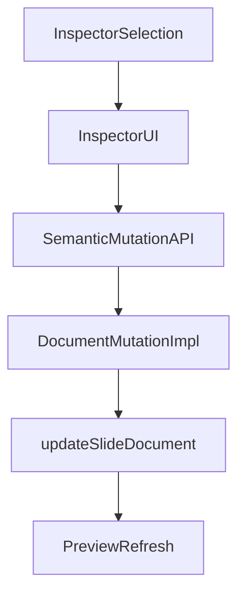
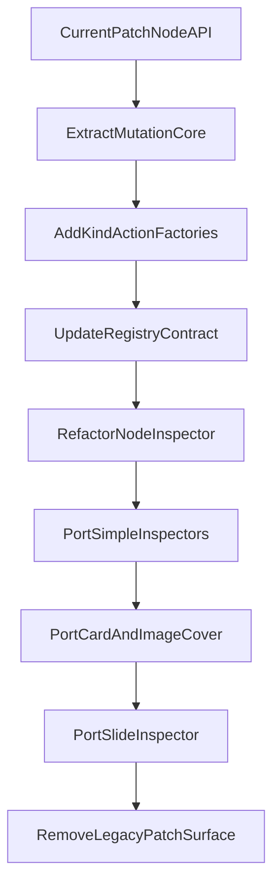

# План внедрения semantic mutation layer в Creator

## Цель
Сделать следующий архитектурный срез после рефакторинга инспектора:
- UI инспекторов больше не мутирует JSON напрямую через `patchNode(path, mutator)` и `patchDoc(...)`;
- изменения проходят через единый слой предметных операций над выбранным объектом;
- JSON остаётся внутренним storage/runtime detail, а не моделью мышления для inspector UI.

Итоговая цепочка должна стать такой:



## Почему этот шаг нужен сейчас
Selection-driven inspector уже есть:
- selection model в [src/creator/editor/inspector/selection.ts](src/creator/editor/inspector/selection.ts)
- shell в [src/creator/editor/inspector/InspectorPanel.tsx](src/creator/editor/inspector/InspectorPanel.tsx)
- dispatch через registry в [src/creator/editor/inspector/NodeInspector.tsx](src/creator/editor/inspector/NodeInspector.tsx)
- kind-инспекторы в `src/creator/editor/inspector/inspectors/`

Но `NodeInspector` всё ещё пробрасывает UI низкоуровневые JSON-патчи:

```1:8:src/creator/editor/inspector/NodeInspector.tsx
import { getNodeByPath, patchNodeByPath } from './pathOps';
import { defaultInspectorRegistry } from './registry.defaults';
import type { InspectorRegistry, NodeInspectorProps } from './registry';
import type { InspectorSelection } from './selection';
```

```47:53:src/creator/editor/inspector/NodeInspector.tsx
  const patchNode = useCallback(
    (path: string, mutator: (node: unknown) => unknown) => {
      if (!doc || !slideId) return;
      const next = patchNodeByPath(doc, path, mutator) as JsonSlideDocument;
      updateSlideDocument(slideId, next);
    },
```

Это означает, что inspector-компоненты всё ещё знают, как патчить storage shape. Следующий шаг — развести ответственность по SRP:
- inspector UI отвечает за поля и действия;
- semantic mutation layer отвечает за доменные изменения;
- JSON patching остаётся внутренней реализацией этого слоя.

## Архитектурная цель
Ввести новый слой между inspector UI и `updateSlideDocument(...)`:

1. `SemanticMutationAPI`
- предметные операции по kind-ам и scope-ам selection;
- стабильный интерфейс для inspector UI;
- без React UI-логики.

2. `Mutation implementation`
- текущие `getNodeByPath` / `patchNodeByPath` и shape-specific update logic прячутся внутри реализации;
- допускается path-based storage внутри implementation, но не в inspector-компонентах.

3. `Action-props for inspectors`
- `NodeInspector` больше не даёт `patchNode` / `patchDoc` наружу;
- вместо этого он даёт action facade, ограниченный текущим `selection.kind`.

## Принципы дизайна
### SRP
- `NodeInspector` только извлекает текущий узел, собирает action facade и рендерит компонент из registry;
- semantic mutations только меняют документ;
- inspector-компоненты только рендерят UI и вызывают actions.

### DRY
- path lookup / clone / patch / replace не размножаются по inspector-ам;
- kind-specific update logic живёт централизованно, а не в каждом компоненте;
- общие update-паттерны (`set optional field`, `replace node`, `patch array item`) выносятся в shared mutation helpers.

### No fallback magic
- Не вводить скрытую fallback-логику уровня «если не получилось semantic action, то тихо патчим JSON напрямую».
- Если для kind нет actions — это явное состояние разработки, а не тихий обход.

## Целевой shape API
Минимальный ориентир:

```ts
interface InspectorActions {
  slide: {
    updateTheme(value: SlideTheme | null): void;
    updateTitle(value: string | null): void;
    updateSpeakerNotes(value: string | null): void;
  };
  header?: {
    updateMeta(value: string): void;
    updateAlign(value: 'left' | 'center' | null): void;
  };
  card?: {
    updateTone(value: 'standard' | 'accent'): void;
    updatePadding(value: 'compact' | 'default' | 'spacious' | null): void;
    updateJustify(value: 'start' | 'end' | 'between' | null): void;
    updateSubtitleVariant(...): void;
  };
  layout?: {
    updateGap(value: 'xs' | 'sm' | 'md' | 'lg' | null): void;
    updateColumns(value: number): void;
    updateRows(value: number): void;
    updateSplitSpans(left: number, right: number): void;
  };
  // etc
}
```

Важно: это не обязательно один гигантский объект. Допустима композиция:
- `createSlideActions(...)`
- `createNodeActions(selection, doc, commit)`
- kind-specific factories

## Порядок реализации
### Этап 1. Выделить mutation core
1. Создать новую зону для semantic mutations, например рядом с inspector или editor.
2. Вынести туда низкоуровневые document operations:
   - получить узел по path
   - заменить узел по path
   - патч optional field
   - патч scalar field
3. Оставить `pathOps.ts` как internal helper этой зоны или разложить на `read` / `write` модули.

Цель этапа: подготовить инфраструктуру, не меняя пока inspector UI.

### Этап 2. Ввести kind-specific action factories
1. Сделать фабрики действий по kind-ам:
   - `createHeaderActions(...)`
   - `createCardActions(...)`
   - `createQuoteActions(...)`
   - `createTextRegionActions(...)`
   - `createLayoutActions(...)`
   - `createStackActions(...)`
   - `createImageCoverActions(...)`
2. Каждая фабрика принимает:
   - `selection.path`
   - `doc`
   - `commit(nextDoc)` или `apply(mutator)`
3. Каждая фабрика возвращает минимальный action-API для своего kind.

Цель этапа: semantic operations уже существуют, но ещё не прокинуты в UI.

### Этап 3. Расширить registry contract
1. Обновить [src/creator/editor/inspector/registry.ts](src/creator/editor/inspector/registry.ts): `NodeInspectorProps` должны получать не `patchNode`, а `actions` и, при необходимости, readonly `node`.
2. Оставить `selection` и `doc` только там, где это действительно нужно для отображения; не давать mutation-примитивы наружу.
3. Переопределить контракт kind-инспекторов так, чтобы они были consumers action API, а не JSON patch API.

Цель этапа: зафиксировать новую ось взаимодействия inspector UI с моделью.

### Этап 4. Переписать `NodeInspector` как action-router
1. В [src/creator/editor/inspector/NodeInspector.tsx](src/creator/editor/inspector/NodeInspector.tsx):
   - перестать пробрасывать `patchNode` / `patchDoc` в kind-components;
   - создавать kind-specific actions по `selection.kind`;
   - прокидывать actions в registry component.
2. Fallback для незарегистрированных kind оставить, но он не должен знать о mutation API.

Цель этапа: центральная точка, где UI перестаёт знать про patching.

### Этап 5. Мигрировать первую волну inspector-компонентов
Сначала перевести уже существующие scalar/property-oriented inspectors, где замена самая дешёвая:
- `HeaderInspector`
- `QuoteInspector`
- `TextRegionInspector`
- `LayoutInspector`
- `StackInspector`
- `ImageCoverInspector`
- `CardInspector`

Порядок важен: сначала простые inspectors, затем более объёмные (`CardInspector`, `ImageCoverInspector`).

Цель этапа: убрать из UI-компонентов знание о прямом JSON patching.

### Этап 6. Отдельно привести `SlideInspector` к тому же принципу
Сейчас `SlideInspector` живёт отдельно от `NodeInspector`, но тоже прямо патчит document и meta.

Нужно:
1. Ввести slide-level actions (`updateTitle`, `updateSpeakerNotes`, `updateTheme`, `updateFrame`, `updateContent`, `updateBackdrop`).
2. Перевести `SlideInspector` на этот API.
3. Убедиться, что slide-level и node-level mutations используют одинаковую базовую инфраструктуру commit/update.

Цель этапа: один mutation language для всей правой панели, не только для node inspectors.

### Этап 7. Удалить legacy mutation surface из inspector layer
Когда первая волна migrated:
1. Удалить `patchNode` / `patchDoc` из публичных inspector props.
2. Почистить старые локальные helpers, которые больше не нужны в inspector UI.
3. Оставить path-level операции только во внутренней mutation implementation.

Цель этапа: закрепить новый архитектурный boundary и не дать коду откатиться назад.

## Предлагаемая структура файлов
### Новая mutation-зона
- `src/creator/editor/mutations/` или `src/creator/editor/semantic-mutations/`
- возможные файлы:
  - `documentMutationOps.ts`
  - `createNodeActions.ts`
  - `createSlideActions.ts`
  - `headerActions.ts`
  - `cardActions.ts`
  - `layoutActions.ts`
  - `imageCoverActions.ts`

### Обновляемые inspector files
- [src/creator/editor/inspector/NodeInspector.tsx](src/creator/editor/inspector/NodeInspector.tsx)
- [src/creator/editor/inspector/registry.ts](src/creator/editor/inspector/registry.ts)
- [src/creator/editor/inspector/SlideInspector.tsx](src/creator/editor/inspector/SlideInspector.tsx)
- `src/creator/editor/inspector/inspectors/*.tsx`

## Миграционная стратегия без big bang


## Риски
- Если сделать один большой `actions` объект на все kind'ы, он быстро разрастётся и потеряет SRP. Лучше композиция factory-by-kind.
- Если оставить доступ к `patchNode` параллельно с actions, новая граница ответственности размоется, и код начнёт жить в двух стилях сразу.
- `CardInspector` и `ImageCoverInspector` могут содержать самые сложные patch-сценарии; их лучше мигрировать после простых kind'ов, чтобы не блокировать весь этап.
- Если action factories начнут принимать и возвращать слишком общий `unknown`, слой снова станет просто обёрткой над JSON patching без реальной semantic value.

## Definition of Done
- Inspector UI больше не вызывает прямые JSON patch mutator-ы.
- `NodeInspector` и `SlideInspector` работают через semantic action API.
- Path-level mutation logic скрыта внутри mutation implementation layer.
- Первая волна существующих inspector-компонентов переведена на actions.
- Новый код соблюдает DRY/SRP: UI рендерит и вызывает действия, mutation layer меняет документ, store коммитит результат.