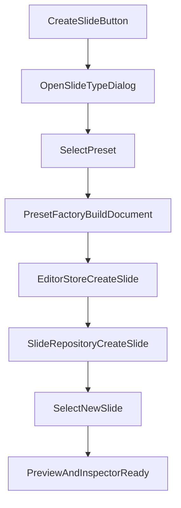

# План модалки выбора типа нового слайда

## Цель
Заменить текущее «создать всегда один и тот же `textStack`» на явный flow:
- пользователь нажимает `Создать слайд`;
- открывается `shadcn/ui`-модалка;
- пользователь выбирает стартовый тип/пресет слайда;
- создаётся валидный документ нужной формы и сразу открывается в редакторе.

## Текущая точка входа
Сейчас кнопки в [src/creator/editor/SlideList.tsx](src/creator/editor/SlideList.tsx) вызывают `store.createSlide()` без параметров, а стор и репозиторий подставляют один дефолтный документ:

```242:245:src/creator/editor/editorStore.tsx
      const slide = await slidesRepo.createSlide(
        deckId,
        { document: createEmptySlideDocument() },
        DEV_USER_ID,
      );
```

```18:21:src/creator/validation/validateSlideDocument.ts
export function createEmptySlideDocument(theme?: SlideTheme): JsonSlideTextStackDocument {
  const doc: JsonSlideTextStackDocument = {
    template: 'textStack',
```

При этом backend-контракт уже готов принять любой стартовый `document`:
- [src/creator/domain/commands.ts](src/creator/domain/commands.ts)
- [src/creator/data/supabase/SupabaseSlideRepository.ts](src/creator/data/supabase/SupabaseSlideRepository.ts)

## UI-решение
Использовать существующие `shadcn/ui` примитивы из:
- [src/creator/ui/dialog.tsx](src/creator/ui/dialog.tsx)
- [src/creator/ui/card.tsx](src/creator/ui/card.tsx)
- [src/creator/ui/radio-group.tsx](src/creator/ui/radio-group.tsx)

### Предлагаемый UX
- Кнопка `Создать первый слайд` и нижняя кнопка `Слайд` открывают одну и ту же модалку.
- В модалке список пресетов как selectable cards или `RadioGroup`-элементы.
- Внизу primary action `Создать`, secondary `Отмена`.
- После выбора пресета вызывается создание слайда и модалка закрывается только при успехе.
- Пока идёт создание, кнопки disabled и показывают pending state.

## Набор стартовых пресетов для первого этапа
Держать scope коротким: 4-5 валидных стартовых документов.

Рекомендуемый набор:
- `textStackTitle` — простой титульный/текстовый `textStack`
- `defaultSplit` — обычный контентный `default + splitLayout`
- `defaultTwoColumns` — `default + equalColumns`
- `defaultGrid` — `default + uniformGrid`
- `imageCover` — обложка `imageCover`

Важно: показывать пользователю человекочитаемые названия, но внутренне хранить стабильные ID пресетов.

## Архитектурный подход
Не раздувать [src/creator/validation/validateSlideDocument.ts](src/creator/validation/validateSlideDocument.ts) новыми ветками. Вместо этого:

1. Оставить `createEmptySlideDocument()` как legacy/default helper.
2. Вынести новый factory-слой стартовых документов в отдельный файл рядом с Creator, например в зоне `src/creator/`.
3. Каждый пресет должен возвращать уже валидный `JsonSlideDocument` своего шаблона.
4. `editorStore.createSlide(...)` должен начать принимать опции/пресет и передавать конкретный `document` в репозиторий.

Это сохраняет разделение ролей:
- validation helper валидирует;
- preset factory создаёт стартовые документы;
- UI только выбирает пресет;
- репозиторий просто сохраняет документ.

## Порядок реализации
1. Расширить store API в [src/creator/editor/editorStore.tsx](src/creator/editor/editorStore.tsx): `createSlide()` должен уметь принимать выбранный пресет или готовый стартовый `document`.
2. Создать factory стартовых документов с 4-5 валидными пресетами на базе типов из [src/presentation/jsonSlideTypes.ts](src/presentation/jsonSlideTypes.ts).
3. Добавить UI-компонент модалки выбора типа слайда в зоне `src/creator/editor/` с использованием `Dialog` + `Card`/`RadioGroup`.
4. Подключить модалку в [src/creator/editor/SlideList.tsx](src/creator/editor/SlideList.tsx) вместо прямого вызова `store.createSlide()` у обеих кнопок создания.
5. После создания автоматически выбирать новый слайд, как сейчас делает store, без изменения текущего post-create поведения.
6. Проверить, что каждый пресет создаёт валидный документ и сразу открывается в preview/inspector без падения в `Raw JSON`.

## Поток данных


## Что не включать в этот этап
- drag-and-drop порядка вставки
- `afterSlideId`-вставку после текущего слайда
- визуальные миниатюры реального содержимого внутри карточек пресетов
- отдельный wizard настройки пресета перед созданием
- генерацию из AI/prompts

## Риски
- Если пресеты собирать прямо в UI-компоненте модалки, логика создания формы документа быстро разъедется и станет трудно тестируемой.
- Если засунуть выбор типа внутрь `createEmptySlideDocument()`, helper перестанет быть «empty/default» и превратится в свалку условий.
- Некоторые шаблоны (`default + layout`) требуют более сложного минимального валидного shape, чем текущий `textStack`; factory должен строить именно валидные документы, а не полуфабрикаты.

## Definition of Done
- Оба entry point создания слайда открывают одну и ту же `Dialog`-модалку.
- Пользователь может выбрать один из стартовых типов и создать слайд без перехода в `Raw JSON` для починки.
- Для каждого пресета создаётся валидный `JsonSlideDocument`.
- Логика стартовых шаблонов живёт отдельно от `validateSlideDocument.ts`.
- Существующий backend/repository контракт не меняется, используется уже существующее поле `CreateSlideInput.document`.