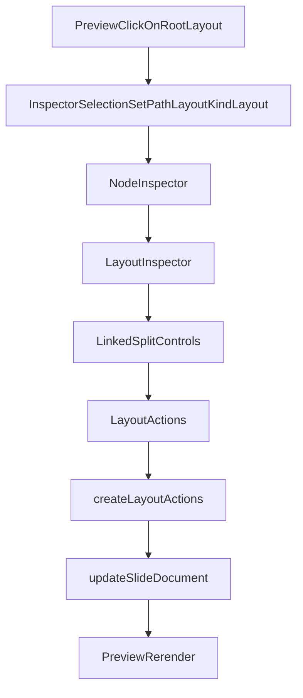

# Layout Editing Foundation

## Goal
Сделать layout в Creator полноценной сущностью редактора, а не побочным кейсом вложенных region-ов. `splitLayout` станет первым доведённым кейсом, но решение должно задать общий паттерн для всех layout-ов: selection, inspector surface, geometry actions и инварианты.

## Current Problems

### Root layout selection не доведён
Сейчас `layout`-inspector существует, но root layout плохо достижим из preview:
- [`src/creator/editor/inspector/inspectors/LayoutInspector.tsx`](src/creator/editor/inspector/inspectors/LayoutInspector.tsx) уже умеет редактировать `gap`, `columns`, `rows`, `leftSpan`, `rightSpan`.
- [`src/creator/editor/mutations/nodeActions.ts`](src/creator/editor/mutations/nodeActions.ts) уже поддерживает `updateSplitSpans()`.
- Но selection wiring сделан в основном на узлы внутри region-ов, а не на сам root layout.

### `splitLayout` edit UX сырой
Текущий UI — два независимых number input-а для `leftSpan` / `rightSpan`.
Это не держит инвариант `leftSpan + rightSpan === 12`, который зафиксирован в контракте layout-а.

### Layout редактируется не как отдельный тип редакторской геометрии
Сейчас layout inspector есть технически, но нет единого продуктового принципа:
- как выбирать root layout;
- как показывать geometry vs content;
- как хранить инварианты layout-а;
- как масштабировать это дальше на `equalColumns`, `uniformGrid`, `bentoGrid`, `stackLayout`.

## Architecture Direction

### 1. Признать root layout самостоятельной selectable-сущностью
Layout должен быть selectable в двух формах:
- root layout документа (`layout` у `default`-слайда);
- nested layout внутри `region.kind === 'layout'`.

Обе формы должны приводить к одному и тому же inspector contract: `kind: 'layout'` + absolute path до layout-узла.

### 2. Отделить layout geometry от content blocks
В модели Creator layout — это не organism и не wrapper, а отдельный geometry-layer.

Это значит:
- `card`, `quote`, `textRegion` редактируют content-семантику;
- `layout` редактирует композицию и пропорции;
- инспектор layout-а должен быть самостоятельной surface, а не случайной технической секцией.

### 3. Для `splitLayout` сделать связанный control model
Выбранная модель: два связанных поля `left/right` с жёстким инвариантом суммы `12`.

Поведение:
- изменение `left` автоматически вычисляет `right = 12 - left`;
- изменение `right` автоматически вычисляет `left = 12 - right`;
- допустимый диапазон для каждого поля — `1..11`;
- состояние never enters invalid geometry;
- mutation layer получает уже согласованную пару значений, а не два независимых числа.

## Implementation Stages

### Stage 1. Сделать foundation для root layout selection
Цель: любой root layout должен быть кликабельно выделяем на preview и открывать `LayoutInspector`.

Файлы:
- [`src/presentation/json-renderer/layouts/renderJsonLayout.tsx`](src/presentation/json-renderer/layouts/renderJsonLayout.tsx)
- [`src/presentation/json-renderer/JsonSlideShell.tsx`](src/presentation/json-renderer/JsonSlideShell.tsx)
- [`src/creator/inline-edit/useEditableBinding.ts`](src/creator/inline-edit/useEditableBinding.ts)
- [`src/creator/editor/inspector/selection.ts`](src/creator/editor/inspector/selection.ts)

Подход:
- дать root layout такой же selectable hook, как уже есть у nested layout в [`src/presentation/json-renderer/nodes/JsonSlideRegionNode.tsx`](src/presentation/json-renderer/nodes/JsonSlideRegionNode.tsx)
- canonical path для root layout: `layout`
- визуально root layout должен выделяться как layout-surface, не ломая дочерние node clicks

Важно: selection layout-а не должен перехватывать клики на `card` / `textRegion` / `quote` content.

### Stage 2. Нормализовать layout inspector как geometry surface
Цель: `LayoutInspector` должен стать первым-class inspector-экраном для geometry.

Файл:
- [`src/creator/editor/inspector/inspectors/LayoutInspector.tsx`](src/creator/editor/inspector/inspectors/LayoutInspector.tsx)

Изменения по роли компонента:
- сохранить общие поля layout-а (`type`, `gap`)
- разделить variant-specific geometry controls по типам layout-а
- подготовить структуру, где каждая variant-specific секция живёт отдельно и не распухает в один монолит

Рекомендуемая внутренняя декомпозиция:
- base section: `type`, `gap`
- split geometry section
- grid geometry section (`uniformGrid`, `bentoGrid`)
- future hook point для `equalColumns` / `asymmetricColumns` / `stackLayout`

### Stage 3. Ввести invariant-safe API для split proportions
Цель: убрать модель “два независимых числа” и зафиксировать layout invariant на уровне action boundary.

Файлы:
- [`src/creator/editor/mutations/actionTypes.ts`](src/creator/editor/mutations/actionTypes.ts)
- [`src/creator/editor/mutations/nodeActions.ts`](src/creator/editor/mutations/nodeActions.ts)

Направление:
- не оставлять UI обязанность самостоятельно хранить валидную геометрию без опоры на action API
- заменить current partial-mutation semantics для `splitLayout` на более доменный контракт, который принимает согласованное изменение

Предпочтительный shape:
- либо `setSplitRatio(left: number)` с автоматическим вычислением right
- либо `setSplitSpans({ left: number, right: number })`, но уже с enforce инварианта внутри factory

Для выбранного UX лучше второй вариант на UI и invariant enforcement внутри mutations: тогда inspector может менять любую сторону, но action layer всё равно защищает геометрию.

### Stage 4. Переделать UI `splitLayout` на linked controls
Цель: сделать понятный продуктовый control для пропорций колонок.

Файл:
- [`src/creator/editor/inspector/inspectors/LayoutInspector.tsx`](src/creator/editor/inspector/inspectors/LayoutInspector.tsx)

Поведение:
- два поля `Left span` / `Right span` связаны между собой
- редактирование одного немедленно пересчитывает второе
- диапазон ограничен `1..11`
- UI показывает, что сумма всегда `12`
- если пользователь вводит невалидное значение, commit не выполняется

Дополнительно:
- под секцией оставить маленький invariant hint вместо нынешнего пассивного текста
- можно показывать короткий read-only summary вроде `5 / 7` или `7 / 5`

### Stage 5. Задать расширяемый паттерн для следующих layout-ов
Цель: чтобы `splitLayout` не остался special case.

После foundation-а следующие layout-типы должны подключаться по той же схеме:
- root/nested selection
- common layout surface
- variant-specific geometry controls
- invariant-safe action API

Ближайшие кандидаты:
- `uniformGrid` — `columns`
- `bentoGrid` — `columns`, `rows`
- позже `equalColumns` / `asymmetricColumns` — управление spans без raw JSON

## Data Flow

## Key Design Rules
- Layout редактируется как geometry-layer, не как content block.
- Root и nested layout используют один и тот же inspector contract.
- Инварианты layout-а защищаются не только UI, но и action layer.
- Никакого fallback-style поведения: при невозможности применить mutation лучше честно не коммитить, чем молча писать неконсистентную геометрию.
- `splitLayout` — первый кейс, но все новые решения должны быть расширяемы на другие layout-variant-ы.

## Verification
- На `default`-слайде с root `splitLayout` можно кликом выбрать именно layout, а не только левый/правый content block.
- В инспекторе появляется полноценный `LayoutInspector` для root layout.
- Изменение `left` автоматически пересчитывает `right`, и наоборот.
- Нельзя получить состояние, где сумма spans не равна `12`.
- Nested layout selection не ломается.
- `uniformGrid` / `bentoGrid` existing controls не регрессируют.
- Прогнать `npm run typecheck` и `npm run build`.

## Suggested Files To Change
- [`src/presentation/json-renderer/layouts/renderJsonLayout.tsx`](src/presentation/json-renderer/layouts/renderJsonLayout.tsx)
- [`src/presentation/json-renderer/JsonSlideShell.tsx`](src/presentation/json-renderer/JsonSlideShell.tsx)
- [`src/creator/inline-edit/useEditableBinding.ts`](src/creator/inline-edit/useEditableBinding.ts)
- [`src/creator/editor/inspector/inspectors/LayoutInspector.tsx`](src/creator/editor/inspector/inspectors/LayoutInspector.tsx)
- [`src/creator/editor/mutations/actionTypes.ts`](src/creator/editor/mutations/actionTypes.ts)
- [`src/creator/editor/mutations/nodeActions.ts`](src/creator/editor/mutations/nodeActions.ts)
- при необходимости [`src/creator/editor/inspector/NodeInspector.tsx`](src/creator/editor/inspector/NodeInspector.tsx), если потребуется небольшая нормализация path/kind routing
